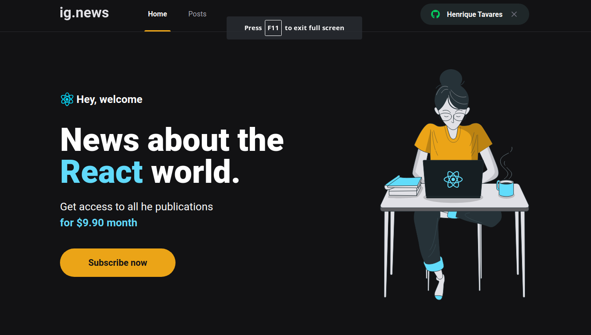

<h1 align="center">Ig.news
</h1>

## 💻 Sobre o projeto

O projeto consiste num blog onde para ler algum psoto você deverá ser assinante, e é usado a API do [Stripe](https://stripe.com/) para o controle de pagamento e salvando os dados dos inscritos no FaunaDB.


## 🖼 Screenshot da tela da aplicação

<br>

<br>

## 🛠 Tecnologias

As seguintes ferramentas foram usadas na construção do projeto:

### **Front-end**

<br>
- [x] React<br>
- [x] Typescript<br>
- [x] NextJS<br>
- [x] FaunaDB<br>
- [x] Axios<br>
- [x] Prismic<br>
- [x] Stripe<br>
- [x] Sass<br>
- [x] ESLint<br>
- [x] Prettier<br>
<br>

## 👷 Como rodar

```bash
# Clone o Repositório
$ https://github.com/MarcelFeo/ignite-rocketseat-ignews.git
```

```bash
# Crie um arquivo .env.local e configure as váriaveis de ambiente

# Stripe
STRIPE_API_KEY=
NEXT_PUBLIC_STRIPE_PUBLIC_KEY=
STRIPE_API_PRICE_KEY=
STRIPE_WEBHOOK_SECRET=
STRIPE_SUCESS_URL=
STRIPE_CANCEL_URL=

# Github
GITHUB_CLIENT_ID=
GITHUB_CLIENT_SECRET=

# FaunaDB
FAUNADB_KEY=

# Prismic CMS
PRISMIC_ENDPOINT=
PRISMIC_ACCESS_TOKEN=
```

```bash
# Baixe as dependendências
$ yarn
```

```bash
# Execute
$ yarn start
```

Acesse <http://localhost:3000> para ver o resultado.
